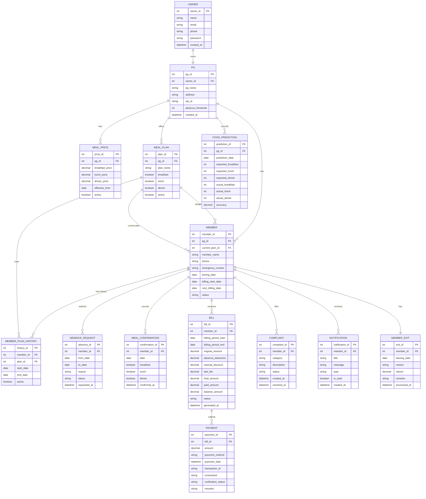

# Database Design

Open this file in VS Code with a Mermaid preview extension to view the ER diagram.

```mermaid
erDiagram
    OWNER {
        int owner_id PK
        string name
        string email
        string phone
        string password
        datetime created_at
    }

    PG {
        int pg_id PK
        int owner_id FK
        string pg_name
        string address
        string upi_id
        int absence_threshold
        datetime created_at
    }

    MEAL_PRICE {
        int price_id PK
        int pg_id FK
        decimal breakfast_price
        decimal lunch_price
        decimal dinner_price
        date effective_from
        boolean active
    }

    MEAL_PLAN {
        int plan_id PK
        int pg_id FK
        string plan_name
        boolean breakfast
        boolean lunch
        boolean dinner
        boolean active
    }

    MEMBER {
        int member_id PK
        int pg_id FK
        int current_plan_id FK
        string member_name
        string phone
        string emergency_contact
        date joining_date
        date billing_start_date
        date next_billing_date
        string status
    }

    MEMBER_PLAN_HISTORY {
        int history_id PK
        int member_id FK
        int plan_id FK
        date start_date
        date end_date
        boolean active
    }

    ABSENCE_REQUEST {
        int absence_id PK
        int member_id FK
        date from_date
        date to_date
        string reason
        string status
        datetime requested_at
    }

    MEAL_CONFIRMATION {
        int confirmation_id PK
        int member_id FK
        date date
        boolean breakfast
        boolean lunch
        boolean dinner
        datetime confirmed_at
    }

    BILL {
        int bill_id PK
        int member_id FK
        date billing_period_start
        date billing_period_end
        decimal original_amount
        decimal absence_deduction
        decimal manual_discount
        decimal late_fee
        decimal final_amount
        decimal paid_amount
        decimal balance_amount
        string status
        datetime generated_at
    }

    PAYMENT {
        int payment_id PK
        int bill_id FK
        decimal amount
        string payment_method
        datetime payment_date
        string transaction_id
        string screenshot
        string verification_status
        string remarks
    }

    COMPLAINT {
        int complaint_id PK
        int member_id FK
        string category
        string description
        string status
        datetime created_at
        datetime resolved_at
    }

    NOTIFICATION {
        int notification_id PK
        int member_id FK
        string title
        string message
        string type
        boolean is_read
        datetime created_at
    }

    FOOD_PREDICTION {
        int prediction_id PK
        int pg_id FK
        date prediction_date
        int expected_breakfast
        int expected_lunch
        int expected_dinner
        int actual_breakfast
        int actual_lunch
        int actual_dinner
        decimal accuracy
    }

    MEMBER_EXIT {
        int exit_id PK
        int member_id FK
        date leaving_date
        string reason
        decimal refund
        string remarks
        datetime processed_at
    }

    OWNER ||--|| PG : "owns"
    PG ||--o{ MEAL_PRICE : "has"
    PG ||--o{ MEAL_PLAN : "offers"
    PG ||--o{ MEMBER : "has"
    PG ||--o{ FOOD_PREDICTION : "records"

    MEAL_PLAN ||--o{ MEMBER : "assigned to"
    MEMBER }o--|| MEAL_PLAN : "current plan"

    MEMBER ||--o{ MEMBER_PLAN_HISTORY : "has history"
    MEMBER ||--o{ ABSENCE_REQUEST : "submits"
    MEMBER ||--o{ MEAL_CONFIRMATION : "records"
    MEMBER ||--o{ BILL : "receives"
    MEMBER ||--o{ COMPLAINT : "files"
    MEMBER ||--o{ NOTIFICATION : "receives"
    MEMBER ||--|| MEMBER_EXIT : "has"

    BILL ||--o{ PAYMENT : "collects"

    MEMBER_PLAN_HISTORY }o--|| MEAL_PLAN : "uses"
```
